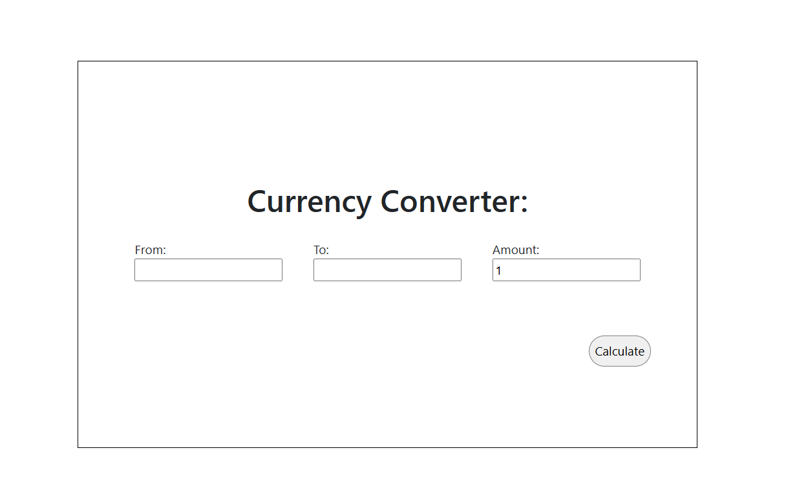

## What is it

A full-stack currency conversion web application where users enter an amount, select a source and target currency, and get the converted result instantly. The Angular frontend communicates with a Java Spring Boot backend that fetches live exchange rates from an external API.

## Problem it solves

Eliminates the need to visit external currency sites or do manual calculations. The app provides a clean, single-page interface backed by real-time exchange rate data, making conversions fast and accurate without leaving the browser.

## How it works

- **Hardware:** None — runs as a backend Java process paired with an Angular dev server or static build.
- **Software:** Java 17, Spring Boot 3.1.5 (REST + WebFlux for reactive HTTP), Gradle for build automation, Lombok for boilerplate reduction. Frontend: Angular 17, TypeScript 5.4, Bootstrap 5.3.
- **Key challenge:** CORS between the Angular dev server and the Spring Boot API is handled via a `WebConfig` bean. The backend uses Spring WebFlux's `WebClient` (reactive, non-blocking) to call [CurrencyAPI](https://currencyapi.com/) and retrieve the latest rates, then returns the calculated result to the frontend in a single GET response.

## Results

Single API endpoint that accepts `from`, `to`, and `amount` query parameters and returns the converted value:

| Endpoint | Description |
|---|---|
| `GET /?from=USD&to=EUR&amount=100` | Returns the converted amount as a double |

Supported currencies: any valid ISO 4217 currency code accepted by CurrencyAPI.

## Photos



---

## Setup

### Backend

Requires a CurrencyAPI key. Add it to `src/main/resources/application.properties`:

```
currency.api.key=your_api_key_here
```

Build and run:

```bash
./gradlew bootRun
```

The backend starts on `http://localhost:8080`.

### Frontend

```bash
cd currency-front-end
npm install
npm start
```

The frontend starts on `http://localhost:4200`.
